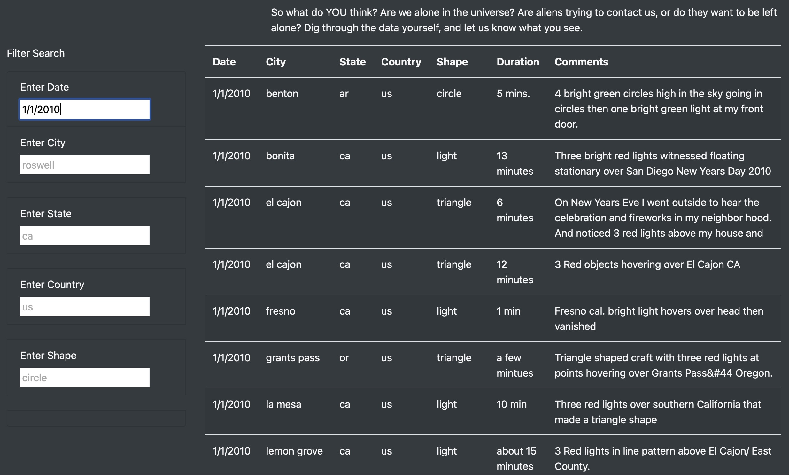
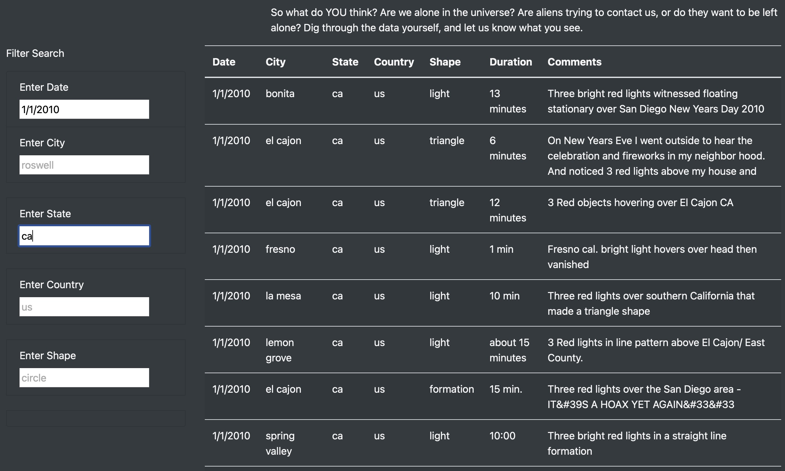
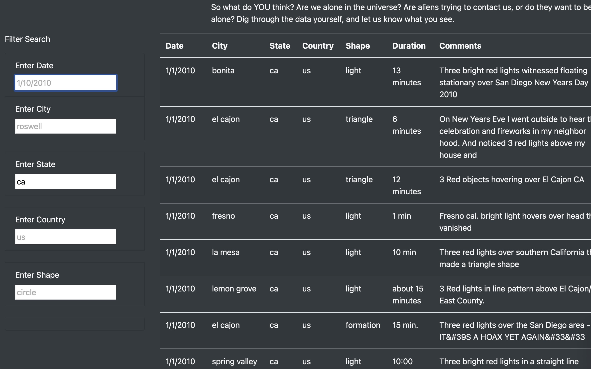
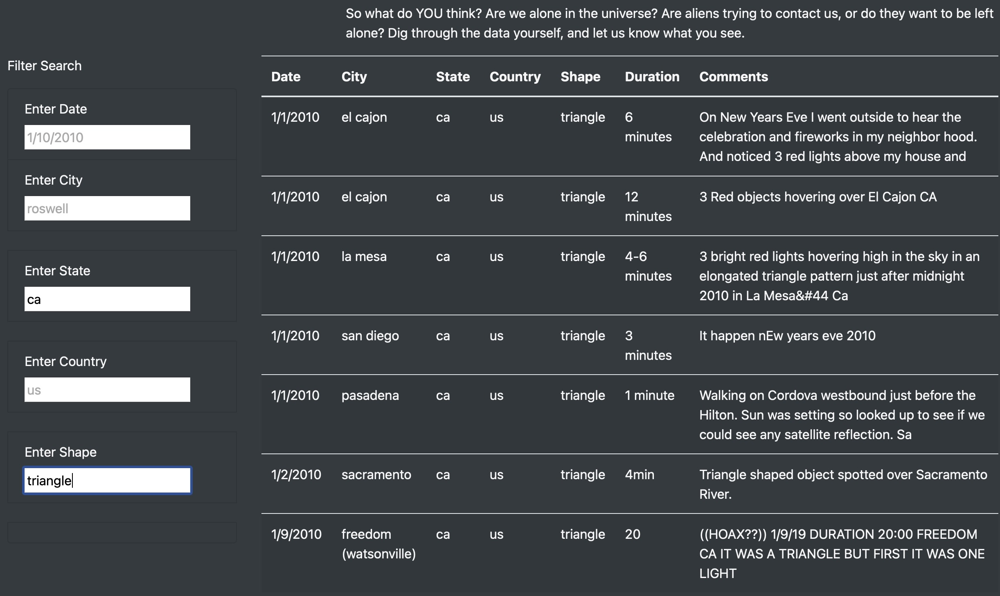

# UFOs

### Overview of Project:

The purpose of this analysis is to provide a more in-depth analysis of UFO sightings by allowing users to filter for multiple criteria at the same time. In addition to the date, users can filters the table data for the city, state, country, and shape.

### Results: 

Describe to Dana how someone might use the new webpage by walking her through the process of using the search criteria. Use images of your webpage during the filtering process to support your explanation.

With the addition of the new filters, users can filter for multiple criteria at the same time. For example, if users would like to filter for UFO sightings on 1/1/2010 they would enter that date in the 'date' box and press entrer. The table will only display UFO sightings that occured on 1/1/2010

If users would like to filter data for UFO sightings on 1/1/2010 in California ONLY, they can type 'ca' in the state box and keep 1/1/2010 in the 'date' box and press enter. The table will display UFO sightings that occurred on 1/1/2010 in California. 

If users would like to see all UFO sightings in California, no matter what day it occurred on, they can remove '1/1/2010' from the date box and keep 'ca' in the state box and press enter. The table will display all UFO sightings in California. 

The same goes for the other filter options. If users would like to filter for 'triangle' shape sightings specifically in California, they can simply enter 'triangle' in the shape filter and 'California' in the state filter. This will return triangle shaped sightings in California. 

### Summary: 

One drawback would be that there is not a 'filter' button for users to click. This may seem obvious, but it would improve the user experience if there were a button to press to filter data. Another helpful additon would be a drop down list of the filter options for each filter. For example, users may not know all of the different shapes they could filter by and having a drop down list with all of the shape options in the table would be a good addition to the website. 
